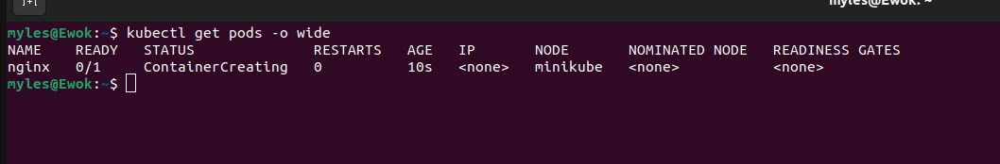
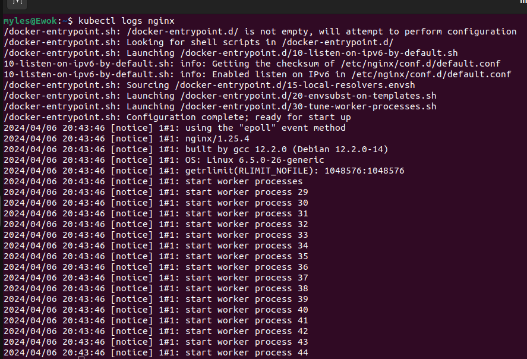
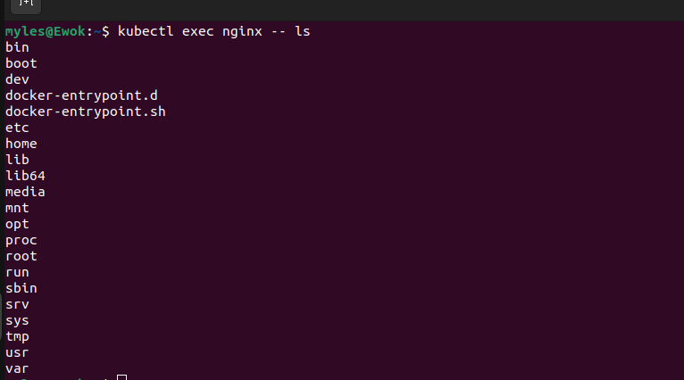
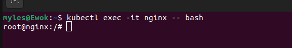
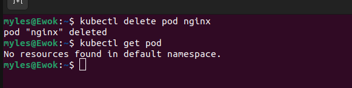

## LAB2: Kubernetes Pod Management

In this lab, you'll learn how to create and manage Kubernetes pods using both imperative and declarative methods.


### Imperative Way

This section demonstrates how to manage pods using imperative commands directly in the terminal.

**Imperative**: In the imperative approach, you directly instruct Kubernetes on what actions to take. This often involves issuing specific commands to create, update, or delete resources. For example, using kubectl run to create a pod imperatively instructs Kubernetes to immediately create the pod with the specified configuration.

#### Steps

1. **Start Minikube**: 

Initialize Minikube to set up your Kubernetes environment. (In this scenario, Kubernetes runs on WSL2-Ubuntu 20.04)
   
   

2. **Create a Pod**:

Run a pod using imperative commands:
   
   ```
   kubectl run nginx --image=nginx
   ```

3. **Get Pod Information**:

View information about the created pod:
```
kubectl get pods -o wide
```

4. **Describe Pod**: 

Retrieve detailed information about a pod for troubleshooting purposes:

```
kubectl describe pod nginx
```


5. **Access Pod Logs**:

View logs from the pod for troubleshooting:
```
kubectl logs nginx
```

6. **Run Commands in Pod**:

Execute commands within the pod:
```
kubectl exec podName -- command
kubectl exec nginx -- ls
```

7. **Access Pod Shell**: 

Enter the pod and run commands interactively:
```
kubectl exec -it nginx -- bash
```

8. **Edit Pod**: 

Modify the pod's configuration using imperative commands:

By default, if the **'EDITOR'** environment variable is not set, kubectl will use the **'vi'** editor. However, you can set the **'EDITOR'** environment variable to your preferred text editor, such as nano, vim, emacs, or any other text editor installed on your system.
```
kubectl edit pod podName

#To change the editor for just the command:
EDITOR=nano kubectl edit pod podName

#If you want to make the change persistent for the current shell session, you can use:
export EDITOR=nano

```
9. **Execute Command with stdin**:

Execute a command in a pod, passing stdin to the container:

```
echo "command" | kubectl exec -i podName -- bash
```

10. **Delete Pod**: 

Remove the pod when it's no longer needed:
```
kubectl delete pod podName
```


**Note on Declarative Way**: While imperative commands are effective, they can be cumbersome to manage. Consider using YAML files to define pod specifications for easier management.

## Declarative Way (With YAML File)
In this section, you'll learn how to define and manage pods using YAML files in a declarative manner.

**Declarative**: In the declarative approach, you specify the desired state of the resources in configuration files (typically YAML or JSON). Instead of specifying the sequence of actions to achieve the desired state, you simply declare what you want the end result to be. Kubernetes then reconciles the current state with the desired state defined in the configuration files and makes any necessary adjustments to achieve the desired state.

1. **Start Minikube**: 

Initialize Minikube to set up your Kubernetes environment. (In this scenario, Kubernetes runs on WSL2-Ubuntu 20.04)
   
   
   
2. **Create a YAML File**: 

Create a YAML file (pod1.yaml) in your directory and define the pod configuration. You can use the following template:
```
apiVersion: v1
kind: Pod
metadata:
  name: firstpod
  labels:
    app: frontend
spec:
  containers:
  - name: nginx
    image: nginx:latest
    ports:
    - containerPort: 80
    env:
      - name: USER
        value: "username"
```

3. **Apply YAML File**:

Apply the YAML file to create the pod declaratively:

```
kubectl apply -f pod1.yaml

#Validate YAML Syntax: Validate the syntax of a YAML file before applying it to avoid errors:
kubectl apply --validate=true --filename=pod1.yaml


```

4. **Describe Pod**:

View detailed information about the created pod:

```
kubectl describe pods firstpod
```

5. **Delete Pod**: 

Remove the pod using the YAML file:

```
kubectl delete -f pod1.yaml
```

### Cleanup: 

If you want to delete Minikube entirely, you can do so with the following command:
```
minikube delete
```
