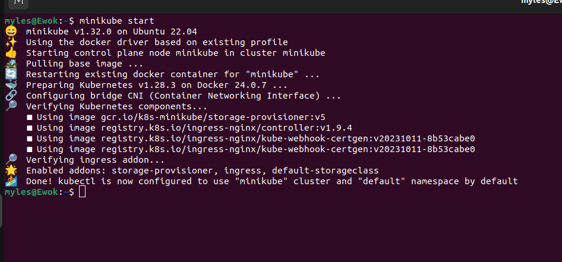
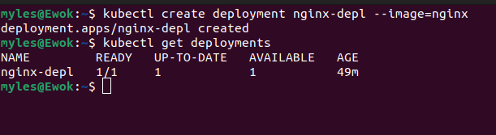

## LAB: Kubernetes Deployment Management

In this lab, you'll learn how to create and manage Kubernetes deployments using both imperative and declarative methods.

### Imperative Way

This section demonstrates how to manage deployments using imperative commands directly in the terminal.


#### Steps

1. **Start Minikube**: 

Initialize Minikube to set up your Kubernetes environment. (In this scenario, Kubernetes runs on WSL2-Ubuntu 20.04)
   
   

2. **Create a Deployment**: Run a deployment using imperative commands:
```
kubectl create deployment deploymentName --image=imageName
```   


3. **Get Deployment Information**: View information about the created deployment
```
kubectl get deployments
```

4. **Scale Deployment**: Scale the number of replicas for the deployment
```
kubectl scale deployment deploymentName -replicas=3
```

5. **Describe deployment**: Describe deployment
```
describe deployment deploymentName
```


6. **Update deployment**: Update the image used by deployment
```
kubectl set image deployment deploymentName containerName=imageName:newTag
```


7. **Rollback Deployment**: Rollback to the previous version of the deployment
```
kubectl rollout undo deployment deploymentName
```


8. **Rollout Status**: Check the status of the rollout after an update
```
kubectl rollout status deployment deploymentName
```


9. **Delete Deployment**: Delete the deployment when it's no longer needed
```
kubectl delete deployment deploymentName
```

Note on Declarative Way: While imperative commands are effective, consider using YAML files to define deployment specifications for easier management.

## Declarative Way (With YAML File)
1. **Start Minikube**: 

Initialize Minikube to set up your Kubernetes environment. (In this scenario, Kubernetes runs on WSL2-Ubuntu 20.04)
   
   

2. **Create a YAML File and Apply**: 

Create a YAML file (**nginx-deployment.yaml**) in your directory and define the deployment configuration. You can use the following template:
```
apiVersion: apps/v1
kind: Deployment
metadata:
  name: nginx-deployment
spec:
  replicas: 3
  selector:
    matchLabels:
      app: nginx
  template:
    metadata:
      labels:
        app: nginx
    spec:
      containers:
      - name: nginx-container
        image: nginx:latest
        ports:
        - containerPort: 80
```
- `apiVersion`: Specifies the Kubernetes API version being used.
- `kind`: Specifies the type of resource, in this case, a Deployment.
- `metadata`: Provides metadata about the Deployment, including its name.
- `spec`: Specifies the desired state of the Deployment, including the number of replicas.
  - `replicas`: Sets the desired number of replicas for the Deployment.
  - `selector`: Specifies how the Deployment selects Pods to manage.
    - `matchLabels`: Defines the labels that Pods must have to be managed by this Deployment.
  - `template`: Defines the Pod template used to create new Pods.
    - `metadata`: Labels Pods with the same labels as the Deployment.
    - `spec`: Specifies the specification for the Pods.
      - `containers`: Specifies the containers within the Pods.
        - `name`: Names the container.
        - `image`: Specifies the Docker image for the container.
        - `ports`: Specifies the ports that the container exposes.


```
kubectl apply -f nginx-deployment.yaml
```


3. Delete Deployment: Remove the deployment using the YAML file:
```
kubectl delete -f nginx-deployment.yaml
```


### Useful tips ! ! ! 

#### Generate YAML deployment using the command line. Don't create it(--dry-run):
```
kubectl run nginx --image=nginx --dry-run=client -o yaml --port=80
```

Generate the Deployment file and don't create it:
```
kubectl create deployment --image=nginx nginx --dry-run=client -o yaml --port=80 > nginx-deployment.yaml
```